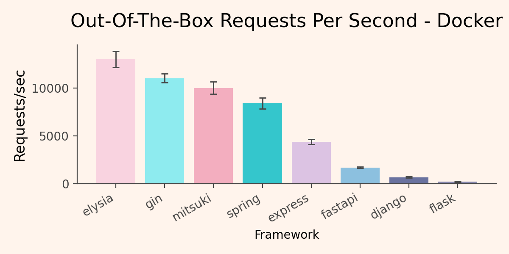
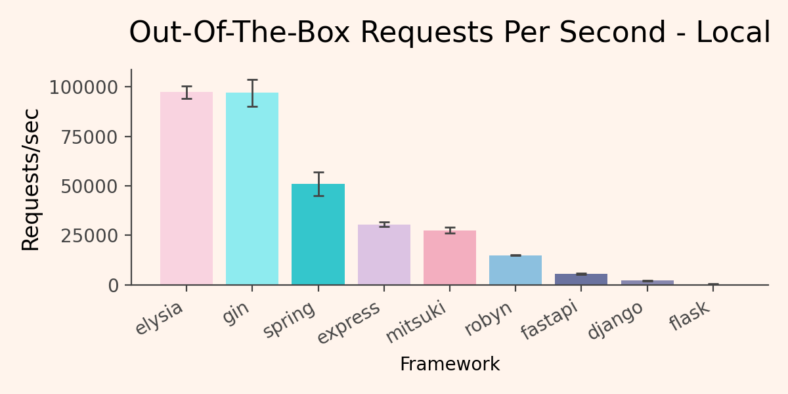

We conduct a basic benchmark, on "Hello World" apps, across different frameworks, in isolated dockerized environments, with roughly equal settings (i.e. access logs turned off).

## Running Benchmarks

To run benchmarks:

```
$ cd benchmarks
$ sh run_benchmarks.sh
```

This will start building each individual image in sequence, running `wrk` and then stopping the image.

Alternatively, you can run them on your host machine via:

```
$ sh run_benchmarks_local.sh
```

### Docker Results

Docker tends to show different speeds than running on a raw host device, due to host binding, emulation (for certain architectures), CPU throttling, networking, etc. Though, it's the de facto most standard way to run applications in production, so it's worth separating a "local" vs "docker" benchmark even in a simple case.

| Framework | RPS | Stdev |
| --- | --- | --- |
| elysia | 12982.89 | 846.43 |
| gin | 11014.0 | 466.89 |
| mitsuki | 10002.7 | 641.97 |
| spring | 8406.71 | 569.69 |
| express | 4374.98 | 273.37 |
| fastapi | 1681.09 | 79.55 |
| django | 655.94 | 62.87 |
| flask | 193.93 | 37.37 |



### Local Results

Running locally, frameworks are unbound more strongly to utilize available resources, but the benchmarks and ordinality will depend more strongly on the specific device you're running on.

| Framework | RPS | Stdev |
| --- | --- | --- |
| elysia | 97327.89 | 3100.0 |
| gin | 96947.7 | 6690.0 |
| spring | 50844.66 | 5940.0 |
| express | 30504.05 | 1270.0 |
| mitsuki | 27463.62 | 1530.0 |
| fastapi | 5400.46 | 276.4 |
| django | 2021.07 | 54.67 |
| flask | 320.72 | 220.92 |




## Reproduction Criteria

All benchmarks are run on regular consumer-grade hardware: *8GB RAM, M1 MacBook Pro, 2019 Edition*

**Note:** Absolute numbers will depend on the hardware being used. What the benchmark is testing is the relative order and order of magnitude, for specific hardware.

To ensure equal environment for testing:
- All servers run on one worker
- All servers disable logging or set it to critical-level only (i.e. disable access logs)
- All servers expose an endpoint on `/`
- All servers just respond with "Hello World"
- All servers have CORS disabled by default
- No extra configuration out of the box besides the ones above
- All servers are run in Docker containers
- All servers are tested with `wrk` with equal configurations
- `wrk` is run outside of the docker containers (so some networking overhead might make these slower than on raw host)

If any library has an underlying assumption that makes these benchmarks invalid, please feel free to point them out or open a pull request.

## Disclaimer

Obviously, different hardware will produce different values, both in absolute and relative terms. Different warmups, wrk parameters, cores, etc. will favor different frameworks (i.e. single-threaded in a loop vs multi-threaded tested in different conditions). Furthermore, there's always optimizations you can run, especially on JVM languages.

Furthermore, a true benchmark includes different operations - plaintext, JSON serialization/validation, database operations, etc.

[TechEmpowered](https://www.techempower.com/benchmarks/#section=data-r23) runs a good benchmark, with more considerations, if you're into that.

We run a *simple* benchmark, not accounting for all possible combinations and circumstances, on *consumer grade hardware* for two reasons:

- It's what you get out of the box, on your device, likely.
- It's a sanity check to confirm that Python web applications can go shoulder-to-shoulder with Java and JavaScript performance-wise.

Running this on different hardware will show different upper ceilings. You can also change the environment such as to favor any framework.

The point is - you can indeed use Python at enterprise scale, without the enterprise pains.

This is where Mitsuki is designed to come in.
