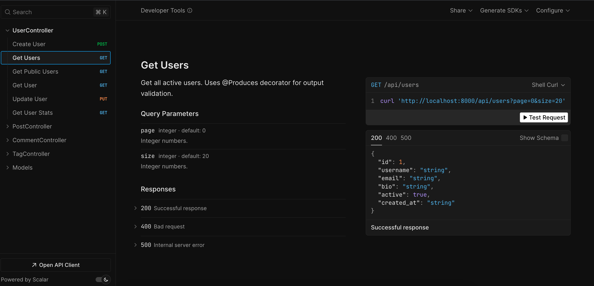

# Learning Mitsuki Through a Blog App

This example application demonstrates the key features of the Mitsuki framework by building a simple but complete blog application. It's designed to be a hands-on guide to understanding how Mitsuki's components work together to create a robust and maintainable web application.

## Introduction to Mitsuki

Mitsuki brings powerful features like dependency injection, component auto-scanning, and a declarative approach to web development to the Python ecosystem. This example will walk you through the core concepts of Mitsuki, using the blog app as a practical example.

## Getting Started

### Running the Application

1.  **Install dependencies:**
    ```bash
    pip install -r requirements.txt
    ```
2.  **Run the application:**
    ```bash
    python3 examples/blog_app/app.py
    ```
    The server will start on `http://localhost:8000`.

### Docs

Mitsuki automatically creates OpenAPI-compliant documentation for you, and exposes Swagger, Redocly or Scalar UIs (or all of them), on `/swagger`, `/redoc` and `/scalar` respectively.

The preferred UI chosen by the user (defaults to `scalar`) is also served on `/docs`:



### Populating the Database

The application starts with an empty database. To explore the API with some sample data, you can use the `populate` endpoint:

```bash
curl -X POST http://localhost:8000/api/posts/populate
```

This will create a few users, posts, tags, and comments, so you can start experimenting with the API right away.

## Core Concepts of Mitsuki

This blog application is built around Mitsuki's core concepts. Let's explore them one by one.

### `@Application`: The Heart of Your App

The `@Application` decorator marks the main entry point of your application. It's responsible for configuring and running the app, including setting up the server, database, and other components.

In our blog app, `app.py` contains the `BlogApp` class decorated with `@Application`:

```python
# examples/blog_app/app.py

from mitsuki import Application

@Application
class BlogApp:
    """Blog application configuration."""

    port: int = 8000
    database_url: str = "sqlite+aiosqlite:///blog.db"
    database_adapter: str = "sqlalchemy"

if __name__ == "__main__":
    BlogApp.run()
```

The `@Application` decorator also triggers **component auto-scanning**. Mitsuki will automatically discover and register all components (`@RestController`, `@Service`, `@CrudRepository`, `@Entity`) in the application directory.

### `@RestController`: Building Your API

The `@RestController` decorator is used to define a REST controller, which is a class that handles HTTP requests. Each method in a controller can be mapped to a specific URL and HTTP method using decorators like `@GetMapping`, `@PostMapping`, etc.

Here's a snippet from our `PostController` in `controllers.py`:

```python
# examples/blog_app/controllers.py

@RestController("/api/posts")
class PostController:
    def __init__(self, post_service: PostService):
        self.post_service = post_service

    @GetMapping("/")
    async def get_posts(
        self, page: int = QueryParam(default=0), size: int = QueryParam(default=20)
    ):
        posts = await self.post_service.search_posts("", page=page, page_size=size)
        return {
            "posts": [self._post_to_dict(p) for p in posts],
            "page": page,
            "size": size,
        }
```

### `@Service`: The Business Logic Layer

The `@Service` decorator marks a class as a service, which is where your application's business logic resides. Services are responsible for coordinating data access and implementing the core functionality of your application.

Our `PostService` in `services.py` is a good example:

```python
# examples/blog_app/services.py

@Service
class PostService:
    def __init__(self, post_repository: PostRepository):
        self.post_repository = post_repository

    async def create_post(self, title: str, slug: str, content: str, author_id: int) -> Post:
        post = Post(title=title, slug=slug, content=content, author_id=author_id)
        return await self.post_repository.save(post)
```

### `@CrudRepository`: Effortless Database Operations

The `@CrudRepository` decorator is used to create a repository, which provides a simple and consistent way to interact with your database. By default, it provides methods for creating, reading, updating, and deleting records (`save`, `find_by_id`, `find_all`, `delete_by_id`, etc.).

Our `PostRepository` in `repositories.py`:

```python
# examples/blog_app/repositories.py

@CrudRepository(entity=Post)
class PostRepository:
    """Repository for Post entity with custom queries."""
```

### `@Entity`: Defining Your Data Models

The `@Entity` decorator is used to define a database model. Mitsuki uses these models to automatically create the database tables when the application starts.

Here's the `Post` entity from `models.py`:

```python
# examples/blog_app/models.py

@Entity
class Post:
    id: int = Field(primary_key=True)
    title: str
    slug: str = Field(unique=True)
    content: str
    author_id: int = Field(foreign_key="users.id")
    ...
```

### Dependency Injection: Automatic Wiring

Mitsuki's dependency injection mechanism automatically wires your components together. When Mitsuki creates an instance of a component (like a controller or a service), it automatically injects the dependencies declared in its `__init__` method.

For example, in our `PostController`, the `PostService` is automatically injected:

```python
@RestController("/api/posts")
class PostController:
    def __init__(self, post_service: PostService):
        self.post_service = post_service # Injected by Mitsuki!
```

### `@Query` and `@Modifying`: Custom Database Queries

For more complex database operations, you can use the `@Query` and `@Modifying` decorators to define custom queries in your repositories.

#### `@Query` with Named Parameters

```python
# examples/blog_app/repositories.py

@Query("SELECT p FROM Post p WHERE p.title LIKE CONCAT('%', :query, '%')")
async def search_posts(self, query: str, limit: int, offset: int): ...
```

#### `@Query` with Positional Parameters

```python
# examples/blog_app/repositories.py

@Query("SELECT p FROM Post p WHERE p.author_id = ?1 AND p.published = ?2")
async def find_by_author_and_status(self, author_id: int, published: bool, limit: int, offset: int): ...
```

#### `@Modifying` for `UPDATE`/`DELETE`

```python
# examples/blog_app/repositories.py

@Modifying
@Query("UPDATE Post p SET p.views = p.views + 1 WHERE p.id = :id")
async def increment_views(self, id: int): ...
```

## API Endpoints

Here's a summary of the available API endpoints. After populating the database, you can try them out yourself!

### Posts

#### `GET /api/posts`
Get all posts with pagination.

```bash
curl http://localhost:8000/api/posts
```

**Response:**
```json
{
    "posts": [
        {
            "id": 1,
            "title": "Getting Started with Mitsuki Framework",
            "slug": "getting-started-mitsuki",
            "content": "Mitsuki is a an opinionated web development framework...",
            "author_id": 1,
            "views": 0,
            "published": 1,
            "published_at": "2025-11-17T19:03:30.457118",
            "created_at": "2025-11-17T19:03:30.444070",
            "updated_at": "2025-11-17T19:03:30.444059"
        }
    ],
    "page": 0,
    "size": 20
}
```

#### `GET /api/posts/search`
Search for posts by title or content.

```bash
curl "http://localhost:8000/api/posts/search?q=Mitsuki"
```

**Response:**
```json
{
    "posts": [
        {
            "id": 1,
            "title": "Getting Started with Mitsuki Framework",
            "slug": "getting-started-mitsuki",
            "content": "Mitsuki is a an opinionated web development framework...",
            "author_id": 1,
            ...
        }
    ],
    "query": "Mitsuki",
    "page": 0,
    "size": 20
}
```

#### `GET /api/posts/{slug}`
Get a specific post by its slug (increments view count).

```bash
curl http://localhost:8000/api/posts/getting-started-mitsuki
```

**Response:**
```json
{
    "id": 1,
    "title": "Getting Started with Mitsuki Framework",
    "slug": "getting-started-mitsuki",
    "content": "Mitsuki is a an opinionated web development framework...",
    "author_id": 1,
    "views": 1,
    "published": true,
    "published_at": "2025-11-17T19:03:30.457118",
    "created_at": "2025-11-17T19:03:30.444070",
    "updated_at": "2025-11-17T19:03:30.444059"
}
```

#### `GET /api/posts/author/{author_id}`
Get posts by a specific author.

```bash
curl http://localhost:8000/api/posts/author/1
```

**Response:**
```json
{
    "posts": [
        {
            "id": 1,
            "title": "Getting Started with Mitsuki Framework",
            "slug": "getting-started-mitsuki",
            "author_id": 1,
            ...
        }
    ],
    "author_id": 1,
    "page": 0,
    "size": 20
}
```

#### `POST /api/posts/populate`
Populate the database with sample data.

```bash
curl -X POST http://localhost:8000/api/posts/populate
```

### Tags

#### `GET /api/tags`
Get all tags.

```bash
curl http://localhost:8000/api/tags
```

**Response:**
```json
{
    "tags": [
        {
            "id": 1,
            "name": "Python",
            "slug": "python",
            "created_at": "2025-11-17T19:03:30.433321"
        }
    ],
    "page": 0,
    "size": 100
}
```

#### `GET /api/tags/{slug}`
Get a tag by its slug.

```bash
curl http://localhost:8000/api/tags/python
```

**Response:**
```json
{
    "id": 1,
    "name": "Python",
    "slug": "python",
    "created_at": "2025-11-17T19:03:30.433321"
}
```

### Comments

#### `GET /api/comments/post/{post_id}`
Get comments for a specific post.

```bash
curl http://localhost:8000/api/comments/post/1
```

**Response:**
```json
{
    "comments": [
        {
            "id": 1,
            "post_id": 1,
            "user_id": 1,
            "content": "This framework looks great",
            "approved": 1,
            "created_at": "2025-11-17T18:54:19.916642",
            "updated_at": "2025-11-17T18:54:31.806844"
        }
    ],
    "post_id": 1,
    "page": 0,
    "size": 50
}
```

#### `POST /api/comments`
Create a new comment.

```bash
curl -X POST http://localhost:8000/api/comments \
  -H "Content-Type: application/json" \
  -d '{"post_id": 1, "user_id": 1, "content": "Great post!"}'
```

**Response:**
```json
{
    "id": 2,
    "post_id": 1,
    "user_id": 1,
    "content": "Great post!",
    "approved": false,
    "created_at": "2025-11-17T19:06:18.861546",
    "updated_at": "2025-11-17T19:06:18.861540"
}
```

#### `PUT /api/comments/{id}/approve`
Approve a comment.

```bash
curl -X PUT http://localhost:8000/api/comments/2/approve
```

**Response:**
```json
{
    "message": "Comment approved"
}
```


We hope this example helps you get started with the Mitsuki framework. Happy coding!